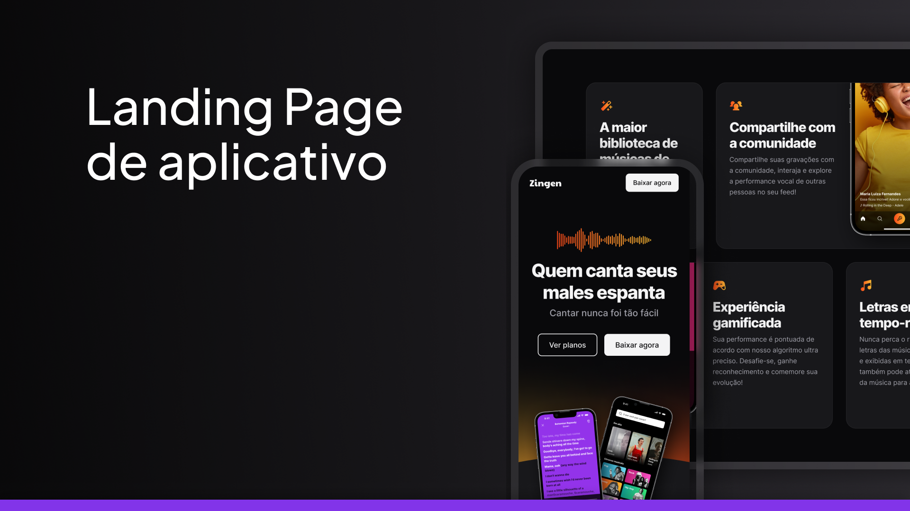

# Zingen

## 🚀 Tecnologias

Esse projeto foi desenvolvido com as seguintes tecnologias:

- **HTML**
- **CSS**

### 📚 Bibliotecas

- [Google Fonts](https://fonts.google.com/)

---

## 💻 Projeto

O **Zingen** é uma página de um app de música no formato **One Page**, totalmente responsiva, ideal para diversos tipos de **micro, pequenas e médias empresas**.

### 🏗 Seções:

✅ Header  
✅ Hero  
✅ Conheça o app  
✅ Planos e preços  
✅ Download  
✅ Footer    
---

## 🔖 Layout

Você pode visualizar o layout do projeto através do link abaixo:  

🔗 [Figma - Zingen](#) https://www.figma.com/design/EfErGwP9wHzvbuOWXLFEXA/LP-de-produto-(Community)?node-id=0-1&p=f&t=YSUnB2er6b0pcvNt-0 

> ⚠️ **Nota**: É necessário ter uma conta no [Figma](https://www.figma.com/) para acessá-lo.

---
 
👋👋👋
